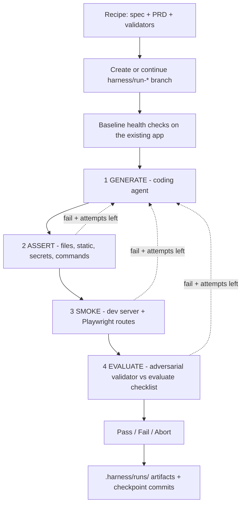

# hedera-harness

TypeScript CLI that builds features into [scaffold-hbar](https://github.com/hedera-dev/scaffold-hbar) projects from a product brief you write. It drives a coding agent, validates what the agent produced, and repairs on failure — recording everything on a git branch you can review.

**The harness decides whether a run passed, not the agent.**

```bash
npx hedera-harness@next init my-app     # or run `init` inside a project you already have
cd my-app
$EDITOR .harness/prd.md            # describe the feature
npx hedera-harness@next doctor          # check the setup before a long run
npx hedera-harness@next run
```

## How a run works

Each attempt runs four stages. Early stages short-circuit the rest, so a failing build never pays for a browser or an agent.



- **fail + attempts left** → focused repair prompt → back to GENERATE
- **fail + budget exhausted** → stay on the harness branch with artifacts
- **harness/tooling failure** (MCP, browser) → **abort**, no repair — the app is not what broke

Every attempt reports what moved, not just pass/fail:

```
Stage 1/4 GENERATE — repair, attempt 3 [opus, escalated — last attempt fixed nothing]
Attempt 3 FAILED — 2 open, 3 fixed, 1 new
```

`2 open, 3 fixed` distinguishes an agent converging from one trading one failure for another — which is what tells you whether another attempt is worth its 15–40 minutes.

## The recipe

`.harness/` inside your project. Everything the harness can default, it defaults:

```yaml
schemaVersion: 3

name: my-feature
description: What you want the agent to build.

baseline:
  commands:
    - name: install          # required — also used for install fingerprinting
      command: yarn install
    - name: build
      command: yarn next:build
```

That is a complete, working recipe. `generator`, `secretScan`, `forbiddenFiles`, validator paths, `prd` and `maxAttempts` all have defaults, and `constraints.forbiddenCommands` is derived from your package manager. The generated skeleton lists every default as a comment so you can see the full surface without carrying it.

Pick the agent with one line:

```yaml
agent: cursor        # or omit for claude (default)
```

That governs the whole run — how the generator is invoked, how the validator receives Playwright MCP, and which models are used. Enabling EVALUATE is then `validator: { enabled: true }`, not a second copy of the agent flags.

See [docs/authoring-a-recipe.md](docs/authoring-a-recipe.md) for the full format.

### Building in increments

For anything larger than a small change, list PRDs in order:

```yaml
prd:
  - .harness/prds/01-foundation.md
  - .harness/prds/02-ui.md
  - .harness/prds/03-onchain.md
```

Each is delivered onto the same branch with its own attempt budget and its own checkpoint commits, and the agent is told which increment it is on and that the earlier ones are done. A failure stops the sequence; `--continue` resumes there rather than redoing delivered work.

For true per-increment grading, pair a checklist with each PRD:

```yaml
eval:
  - .harness/evals/01-foundation.json
  - .harness/evals/02-ui.json
  - .harness/evals/03-onchain.json
```

List `eval:` must be 1:1 with `prd:`. A scalar `eval: .harness/eval.json` still works and grades every slice against the same checklist. Only the active PRD/eval pair is vendored each increment — later checklists are not visible to earlier slices.

One large PRD with three repair attempts is a poor fit for a real feature: the work exceeds the budget, and a failure loses all of it.

## Validation stages

| Stage | Enable with | What it proves | Cost |
|---|---|---|---|
| **ASSERT** | on by default | files present, static assertions, no secrets, build passes | seconds |
| **SMOKE** | `validators.playwright` | the app boots and its routes actually render | a dev server boot |
| **EVALUATE** | `eval` + `validator.enabled` | an adversarial agent drives the live app against the evaluate checklist | an agent session |
| **CHAIN** | `chainValidation` | an ephemeral funded testnet signer completes real transactions, verified via mirror node | testnet HBAR |

Start at the bottom. Add a stage when the one below stops catching your failures.

The EVALUATE validator is told to **fail on uncertainty**. If it cannot reach the browser it says so and fails the assertion rather than guessing, so a passing verdict means something.

## Branch behaviour

| Current branch | Recipe | Behaviour |
|---|---|---|
| `harness/run-feature-abc` | same | **continue** — resume attempts |
| `harness/run-feature-abc` | different | **new branch** |
| `main` or other | any | **new branch** |

```bash
hedera-harness run --new                                  # force a fresh branch
hedera-harness run --continue harness/run-my-feature-abc  # resume a specific one
```

The harness never pushes, opens a PR, merges, deletes a branch, or switches away. It requires a clean tree and does not auto-stash. Checkpoint commits stage explicit paths — never `git add -A` — and refuse to stage runtime or secret paths.

## CLI

```bash
hedera-harness init [dir] [--repo URL] [--ref branch] [--template name] [--skip-install]
hedera-harness run [spec] [--max-attempts N] [--new] [--continue <branch>]
hedera-harness doctor [spec] [--workspace <path>] [--recipe-only]
hedera-harness status [spec] [--workspace <path>] [--watch] [--json]
hedera-harness validate [spec] [--workspace <path>]
hedera-harness validate-semantic [spec] [--workspace <path>]
```

**`init`** decides what to do from the target:

| Target | Behaviour |
|---|---|
| missing or empty | clone scaffold-hbar and provision `.harness/` |
| holds a `package.json` | adopt the harness in place, no clone |
| non-empty, not a project | refused |

`--template hedera-demo` selects a scaffold-hbar template branch. `init` never overwrites an existing recipe — it reports what it kept.

**`doctor`** reports everything at once instead of stopping at the first problem: node, git, git state, the recipe and its warnings, the agent CLI, the package manager, every path the recipe references, Playwright when SMOKE is on, and `chainValidation` env vars. A real run costs 40 minutes to two hours; this costs seconds.

**`status`** reports what the newest run is doing: stage, attempt, elapsed time, the agent's last activity, tool-call counts, and findings once an attempt has been graded. A run takes 40 minutes to two hours and the loop has always written `.harness/runs/<id>/status.json` on every phase change and on a 15-second heartbeat — `status` is the reader, so progress no longer depends on keeping the launching terminal in view.

```bash
hedera-harness status            # one snapshot
hedera-harness status --watch    # repaint until the run finishes
hedera-harness status --json     # machine-readable, for scripts and CI
```

It is read-only, and it says so when a `_running` phase stops heartbeating — a run whose terminal was closed reports `no heartbeat, the run may have stopped` rather than looking alive forever.

## Configuration

Operational knobs live in the environment, not the recipe. Editing a recipe to shorten a timeout produces a spurious project diff, and on a template branch it gets committed by mistake.

| Variable | Effect |
|---|---|
| `HARNESS_MAX_ATTEMPTS` | repair attempts per run |
| `HARNESS_AGENT_TIMEOUT_S` | wall-clock budget per agent invocation |
| `HARNESS_AGENT_IDLE_TIMEOUT_MS` | kill an agent that stops producing output (default 90000) |
| `HARNESS_MODEL` / `HARNESS_FIX_MODEL` | override the preset's models |
| `HARNESS_NO_MODEL_SWITCH` | disable dropping to a cheaper model on repairs |

Precedence: CLI flag > environment > recipe > harness default.

**Model escalation.** Repairs run the cheaper model, *except* after an attempt that fixed nothing — paying less to repeat a failure is not a saving, so it escalates back.

**Prompts are files.** Everything the agent is told lives in [`prompts/`](prompts/) as markdown. Override any single one at `.harness/prompts/<name>.md`; `doctor` reports which are overridden, since an override is a copy that will not receive later changes.

## Prerequisites

**Always:** Node.js ≥ 20, git, and an authenticated agent CLI — Cursor (`agent`) or Claude Code (`claude`).

```bash
# schema v3 prerelease — npm latest is still 1.2.2
npm install -D hedera-harness@next
npx hedera-harness doctor
```

Playwright (SMOKE) and `@hiero-ledger/sdk` (CHAIN) ship inside `hedera-harness` — do not add them to the project.

```bash
# CHAIN — funded ECDSA operator in the shell (the SDK is already in the harness)
export HEDERA_OPERATOR_ID=0.0.xxxx
export HEDERA_OPERATOR_KEY=0x...      # ECDSA — ED25519 has no EVM alias
```

**SMOKE and EVALUATE share one browser policy.** The harness uses Playwright
Chromium when that binary is already on disk and otherwise launches system
Chrome. Neither stage needs a project `yarn add playwright`, and neither
requires a separate Chromium download when Chrome is installed.
For EVALUATE, the harness launches its pinned `@playwright/mcp` version through
`npx` and supplies the MCP configuration itself; do not copy an `.mcp.json`
into the project. Run `npx hedera-harness@next doctor` to launch-probe the selected
browser.

See [`.env.example`](.env.example). The harness does not auto-load `.env`, and never writes credentials into the workspace.

## Project layout after `init`

```
my-app/
├── .harness/
│   ├── spec.yaml              # the recipe
│   ├── prd.md                 # what to build
│   ├── validators/
│   ├── prompts/               # optional per-project prompt overrides
│   ├── runtime/               # every skill + context, vendored per run (gitignored)
│   └── runs/                  # artifacts + session.json (gitignored)
└── packages/
```

Harness logs always live under `.harness/runs/` and are not configurable — pointing them elsewhere would leave untracked files that fail the next run's clean-tree check.

## Skills

Recipes do not list skills. Each run clones [`hedera-dev/hedera-skills`](https://github.com/hedera-dev/hedera-skills) (cached under `.skill-cache/`) and vendors every `SKILL.md` from the product plugins (`native-services-js`, `system-contracts`, `cross-chain`, `dev-intelligence`) into `.harness/runtime/skills/`. The generator picks what the PRD calls for.

Authoring, CLI, hackathon, and agent-kit plugins are not offered to the generator — those stay Cursor marketplace skills. Override the source with `HARNESS_SKILLS_REPO` / `HARNESS_SKILLS_REF`.

To author recipes with an agent, install the marketplace plugin:

```
/plugin marketplace add hedera-dev/hedera-skills
/plugin install hedera-harness
/create-harness-spec
```

## Repository layout

```
├── src/                      # implementation
├── prompts/                  # agent prompts (shipped; overridable per project)
├── skeletons/project-harness # provisioned by `init`
├── scripts/                  # e2e and EVALUATE verification helpers
├── docs/                     # authoring-a-recipe.md, how to write a PRD
└── test/
```

## Scripts

| Command | Description |
|---|---|
| `npm run build` | Clean and compile to `dist/` |
| `npm run typecheck` | Type-check without emitting |
| `npm test` | Build, then run the Node test suites |
| `npm run smoke:pack` | Pack a tarball and smoke-install it with Yarn 3 |

## Design notes

- **Validation is authoritative** — agents do not declare success; the harness does.
- **Infrastructure failures are not app failures** — an MCP or browser problem aborts rather than handing the agent a repair prompt for something it did not break.
- **The project is the workspace** — one git worktree, versioned by `harness/run-*` branches and checkpoint commits.
- **Nothing is pushed for you** — completion prints the next steps and stops.
- **Secrets never reach artifacts** — prompts and logs are redacted, the ephemeral signer file is `0600`, and checkpoints refuse to stage secret paths.

## License

MIT
